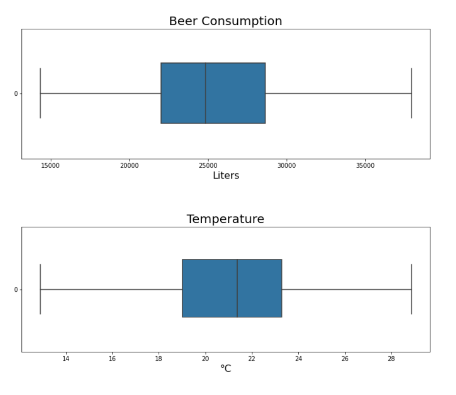
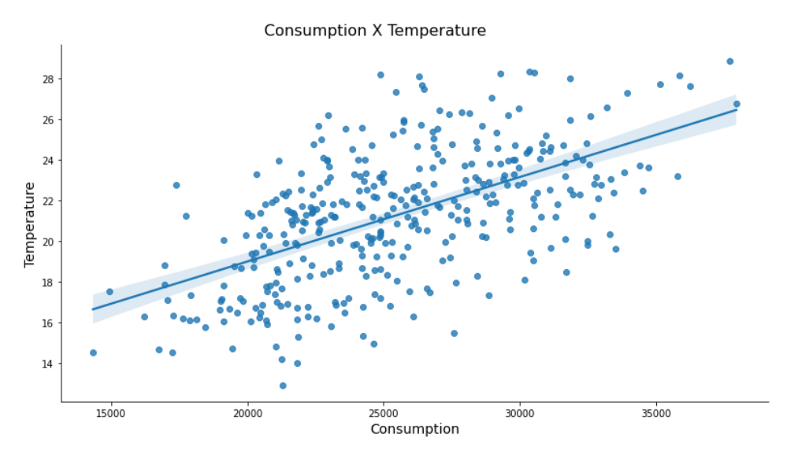
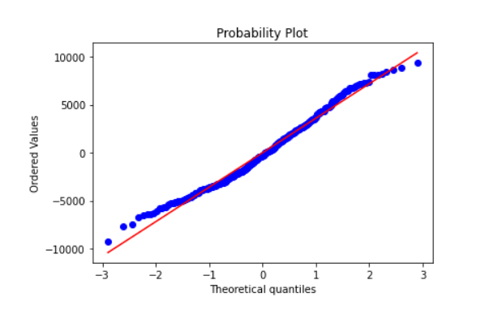

In this exercise I would like to predict the amount of beer that will be consumed given the temperature of the day.

The data (sample) were collected in São Paulo - Brazil, in a university area, where there are some parties with groups of students from 18 to 28 years old (average).

Technologies:
- Python 
    - Pandas
    - Numpy
    - Seaborn
    - Statsmodels
    - Scipy
___
The live demo can be accessed on this link: https://colab.research.google.com/drive/1m1KfDUd7VomYeiNZweKpC_N-h2PkwwsS?usp=sharing
___

The complete dataset can be [found here](beer_consumption.csv), it follows this format:


### Data:
- **Consumption** - Beer consumption (liters) (dependent variable, Y)
- **Temperature** - Average Temperature (°C)

|Y|X|
|---|---|
|25461|27.3|
|28972|27.02|
|30814|24.82|
___

### Renaming the columns
```
data.columns = ["Consumption","Temperature"]
```
|Consumption|Temperature|
|---|---|
|25461|27.3|
|28972|27.02|
|30814|24.82|
___
Checking the graph for outliers

```
ax1 = sns.boxplot(data=data.Consumption, orient='h', width=0.5)
ax2 = sns.boxplot(data=data.Temperature, orient='h', width=0.5)
```

___
Checking if there is a linear relationship between variables Consumption and Temperature.

```
ax3 = sns.lmplot(x="Consumption", y="Temperature", data=data)
```

```
data.corr()
```
||Consumption|Temperature
|---|---|---|
Consumption|1.00|0.57
Temperature|0.57|1.00

It's possible to say that Consumption and Temperature have a correlation of 0.57.
___

### Preparing the data to estimate a simple linear regression model
```
CONS = data.Consumption
TEMP = sm.add_constant(data.Temperature)
```
### Estimating the simple linear regression model
```
linear_regression = sm.OLS(CONS, TEMP).fit()
```
### Getting the predicted Consumption
```
data['Cons_predict'] = linear_regression.predict()
```
### Using the estimated model to make predictions.

What would be the beer consumption for a day with an average temperature of 42°C?
```
linear_regression.predict([1,42])[0]
```
41,913.97 liters
___
### Getting the regression residuals

```
data['Residual'] = linear_regression.resid
data['Residual'].mean() 
```
1.085 e-11 (close to 0, so, it's OK)

### Plot the QQPlot of the residuals
```
probplot(data['Residual'], plot = plt)
```


To use linear regression, one of the assumptions is normality of the residuals and this premise was satisfied.