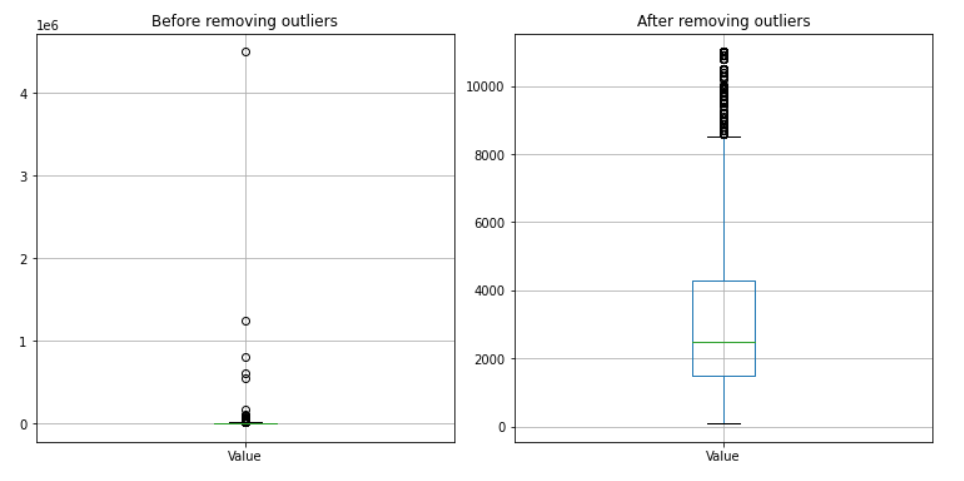
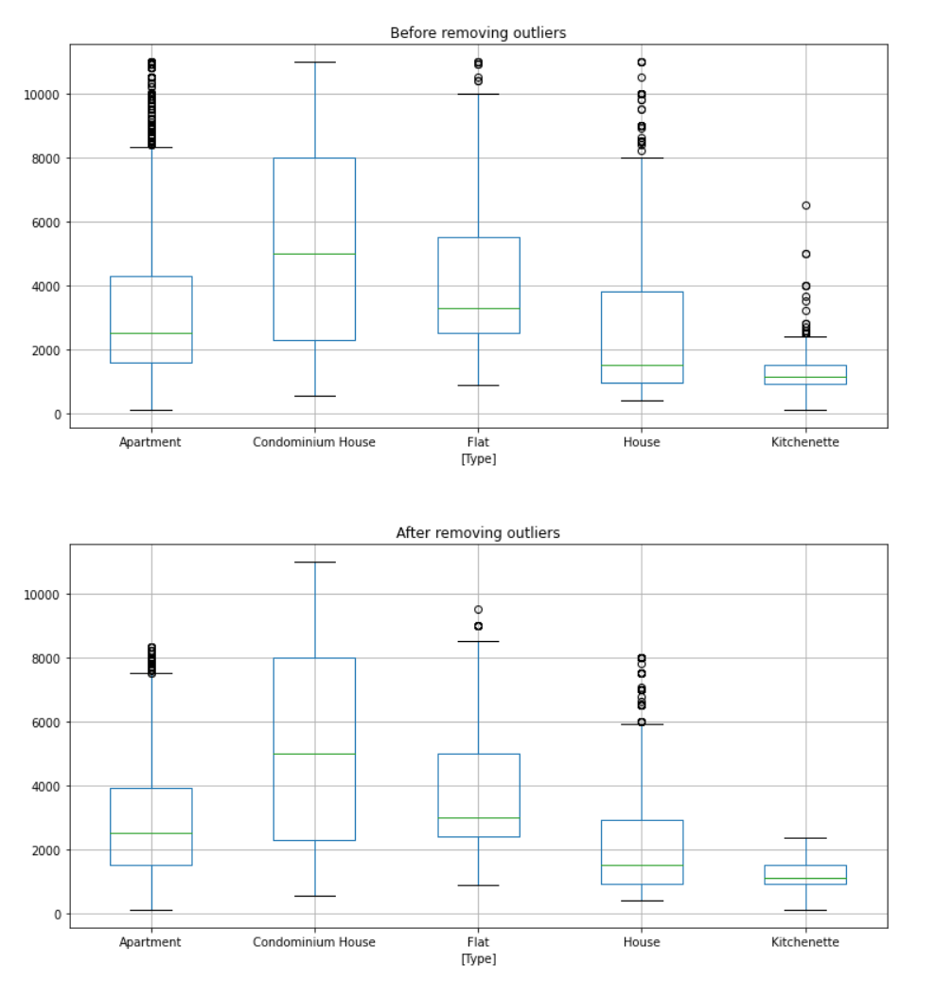

Assignment on statistical course with Python.

Objectives:
- Learn how to clean data, removing nulls and outliers.

Technologies:
- Python
- Pandas
___
The live demo can be accessed on this link: https://colab.research.google.com/drive/1irmWl-jx494ZCusAhybP_fTgOSQeVkZS?usp=sharing

The complete dataset can be [found here](rent.csv), it follows this format:

|Type|Neighborhood|Bedrooms|Garage|Suites|Area|Value|Condominium_Fee|Tax|
|---|---|---|---|---|---|---|---|---|
|Kitchenette|Copacabana|1|0|0|40|1700|500|60
|House|Jardim Botânico|2|0|1|100|7000||
|Commercial Space|Barra da Tijuca|0|4|0|150|5200|4020|1111
|Apartment|Centro|1|0|0|15|800|390|20
|Apartment|Higienópolis|1|0|0|48|800|230|
___

Results:
- Properties with null value removed
```
dataset.dropna(subset = ['Value'], inplace = True) 
```
- 22 types of properties divided into 2 aggregate types: Residential and Others.
```
selection = ~(dataset['Aggregate Type'] == 'Other')
dataset_residential = dataset[selection]
```
- Before and after remove outliers from residential properties:

- Before and after remove outliers by group (inside residential):



