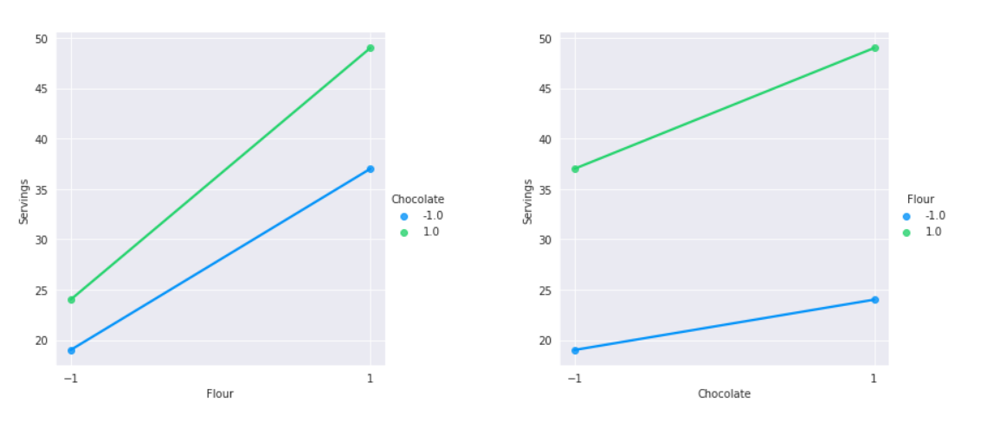
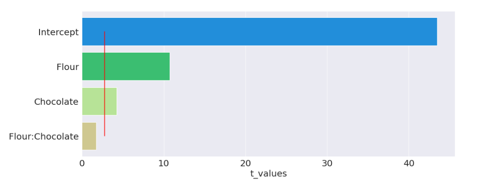
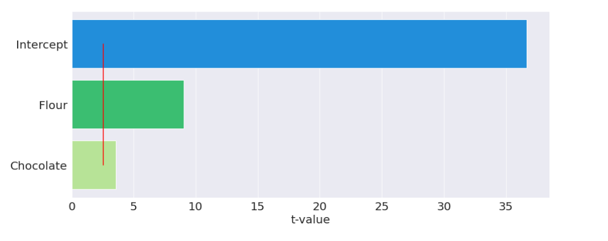
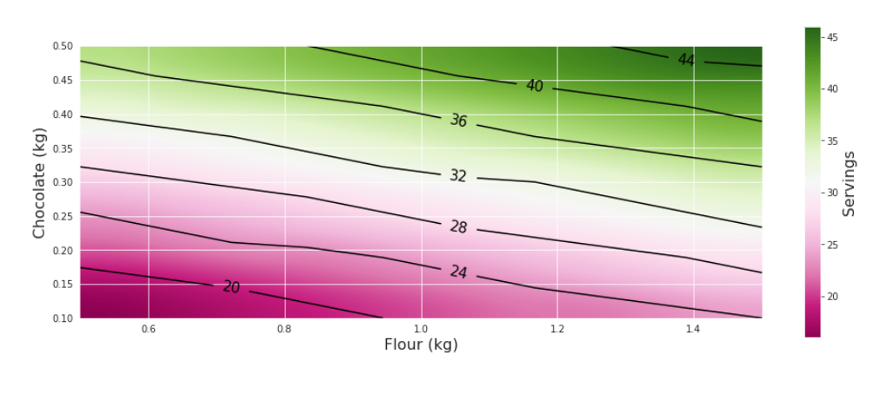

Assignment on experiment planning course with Python.

Objectives:
- Learn to design experiments for data collection.
- Propose mathematical models to understand a given problem.
- Test the statistical significance of the parameters of a mathematical model.
- Build color maps to aid in data interpretation.

Technologies:
- Python 
    - Pandas
    - Numpy
    - Seaborn
    - Statsmodels
    - Scipy
    - Matplotlib
___
The live demo can be accessed on this link: https://colab.research.google.com/drive/1Qj_gH-MN0Sypkx68t2c564soGm7Gj5eo?usp=sharing
___
The problem:

Our baker client is starting a business to sell **cupcakes**. She would like to better understand the cupcake **recipe**, especially the influence of **flour** and **chocolate** on the final amount of cupcakes produced.
We will run an experiment from its planning, through data collection to analysis of results, obtaining the information she wants to increase her company's profits.

In this experiment, she will control the system, varying the amount of flour and chocolate, and count the number of cupcakes produced in each batch.

After researching cookbooks, we came to the conclusion that, for this customer, the best min and max amounts for flour and chocolate are in the table below:

| |min (kg)|max (kg)|
|---|---|---|
|Flour|0.5|1.5|
|Chocolate|0.1|0.5|

Tests

|Test|Flour (kg)|Chocolate (kg)|Servings|
|---|---|---|---|
|1|0.5|0.1|19|
|2|1.5|0.1|37|
|3|0.5|0.5|24|
|4|1.5|0.5|49|

It is traditional in carrying out factorial designs that the experimental points are normalized between -1 and +1. For this, we will move our experimental area towards the origin of the Cartesian plane. In this way, the lower limit will receive the value -1, and the upper limit +1.

|Test|Flour (kg)|Chocolate (kg)|Servings|
|---|---|---|---|
|1|-1|-1| 19| 
|2|1|-1|37|
|3|-1|1|24|
|4|1|1|49|
___
In the first graph we vary the amount of flour (minimum and maximum), the blue line represents the mixture with the minimum of chocolate and the green line with the maximum of chocolate.


In the second graph we vary the amount of chocolate (minimum and maximum), the blue line represents the mixture with the least amount of flour and the green line with the maximum amount of flour.



It is possible to see that the variation in the amount of flour has much more influence on the final amount of cupcakes produced than the variation in the amount of chocolate.
___
A model was created to predict the amount of cupcakes produced, taking into account the amount of flour, chocolate and the interaction of these two ingredients.


```
model = smf.ols(data = experiment, formula = 'Servings ~ Flour + Chocolate + Flour:Chocolate')
fitted_model = model.fit()
```

To do the statistical analysis of the significance of the parameters and to evaluate the error of the statistical fit (to check how well this model is adjusted to the experimental data) we need the degrees of freedom of the residuals greater than zero. Then 4 more tests were performed with the average values of flour and chocolate. The results were:
|Test|Flour (kg)|Chocolate (kg)|Servings|
|---|---|---|---|
|4|0|0|29|
|5|0|0|30|
|6|0|0|29|
|7|0|0|30|
___
The model was redone and now we can evaluate the coefficients of the formula we created.



For a significance of 5%, the interaction between flour and chocolate has no influence on the amount of cupcakes produced. So it was removed from the formula.

The new model formula is: 
```
model_2 = smf.ols(data = experiment, formula = 'Servings ~   Flour + Chocolate')
fitted_model_2 = model_2.fit()
```


Now we can see that all variables have an influence on the amount of cupcakes produced, for a significance of 5%. Therefore, we have a model capable of predicting the amount of cupcakes produced given the amount of flour and chocolate in the recipe.
___

A function was created whose inputs are the amount of flour and chocolate and the output is the amount of cupcakes produced.

```
def recipe_model(x_f, x_c):
    
    #limit
    limit_normalized = [-1,+1]
    limit_flour = [0.5,1.5]
    limit_chocolate = [0.1,0.5]
    
    #Converted 
    x_f_converted = np.interp(x_f, limit_flour, limit_normalized)
    x_c_converted = np.interp(x_c, limit_chocolate, limit_normalized)
    
    
    Servings = params['Intercept'] + params['Flour']*x_f_converted  + params['Chocolate']*x_c_converted
    
    return round(Servings)
```

A heat map was also created to help the client visualize these results:



“Today I would like to produce around 40 cupcakes, but I have 1.4 kilograms of flour, how much chocolate will I need?”. With this chart the baker can easily have an answer.

Now have an accurate understanding of the influence of the amount of flour and chocolate on the amount of cupcakes produced.