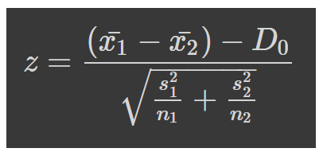

Assignment on statistical course with R to test the hypothesis that the average income of workers in Rio de Janeiro is lower than the average income of workers in São Paulo.

Technologies:
- R
    
___
The live demo can be accessed on this link: https://colab.research.google.com/drive/18BItph2voMN5OLu3d6Sl9ek7I_z-IhgI?usp=sharing
___


You are a researcher who studies the Brazilian labor market and decides to study the salary differences of workers in the states of Rio de Janeiro (RJ) and São Paulo (SP). During your research you find that, apparently, the income of workers in the state of Rio de Janeiro is lower than the income of workers in the state of São Paulo. To confirm this conclusion, perform a hypothesis test comparing the means on two samples of workers from the two states.

Consider the 5% significance level.

Test the hypothesis that the average income of workers in Rio de Janeiro is lower than the average income of workers in São Paulo.


The complete dataset can be [found here](income_rj_sp.csv), it follows this format:

|Income_RJ|Income_SP|
|---|---|
|1300|1800
|35000|700
|1300|8000

___
### Formulation of the hypotheses H0 and H1

<font color='aqua'>The null hypothesis always contains the equality claim</font>

μ1 ⇒ Average income in Rio de Janeiro

μ2 ⇒ Average income in São Paulo 

H0: μ1 ≥ μ2
-

H1: μ1 < μ2
-


Infos:
```
significance <- 0.05  #alpha
n_rj <- nrow(data)
n_sp <- nrow(data)
D_0 <- 0
```


```
z_alpha <- qnorm(significance)
```
z_alpha = -1.64

```
mean_sample_rj <- mean(data$Income_RJ)
mean_sample_sp <- mean(data$Income_SP)
standard_deviation_sample_rj <- sd(data$Income_RJ)
standard_deviation_sample_sp <- sd(data$Income_SP)
```


```
numerator <- (mean_sample_rj - mean_sample_sp) - D_0

denominator <- sqrt((standard_deviation_sample_rj ** 2 / n_rj) + (standard_deviation_sample_sp ** 2 / n_sp))

z <- numerator / denominator
```
z = -2.25
___
### <font color='aqua'>Critical value criteria</font>

z <= z_alpha  →  REJECT H0

### <font color='aqua'>P_value criteria</font>
```
p_value <- pnorm(z, lower.tail = T)
```
p_value = 0.012

p_value <= significance  →  REJECT H0
___

Conclusion: With a confidence level of 95% we reject  H0. The average Income in the state of Rio de Janeiro is lower than the average Income in the state of São Paulo.