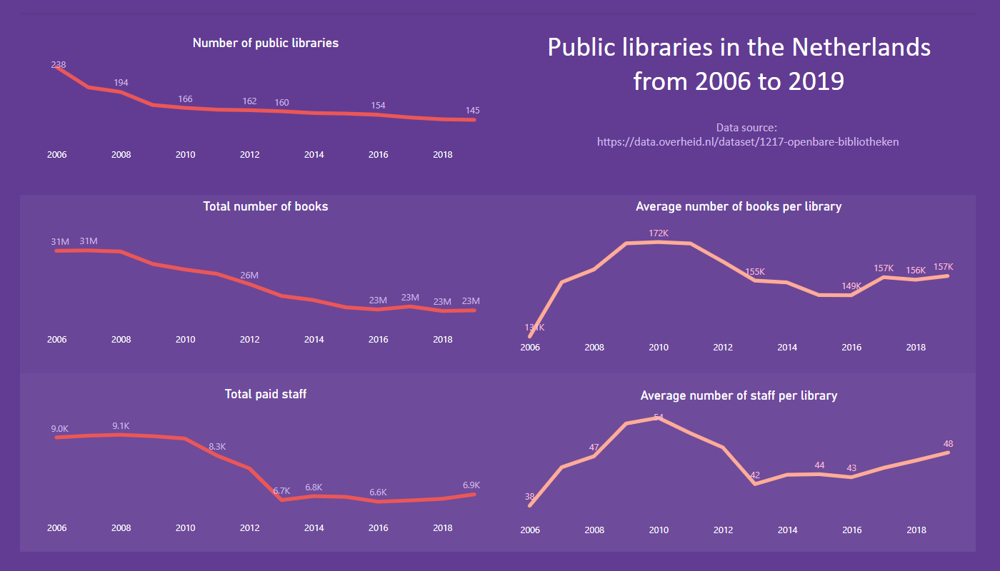
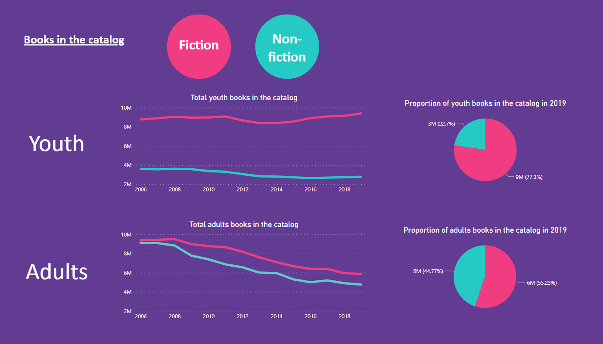
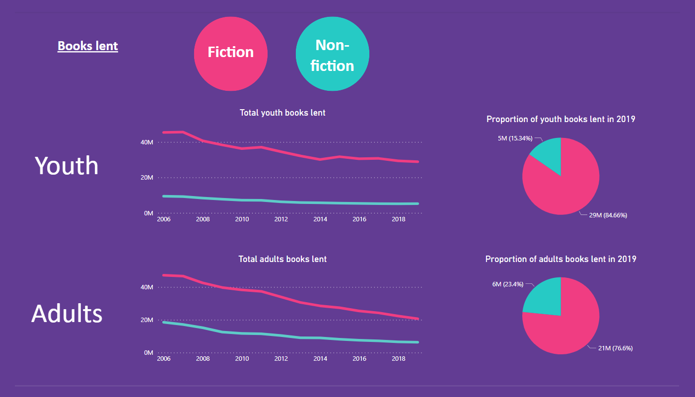
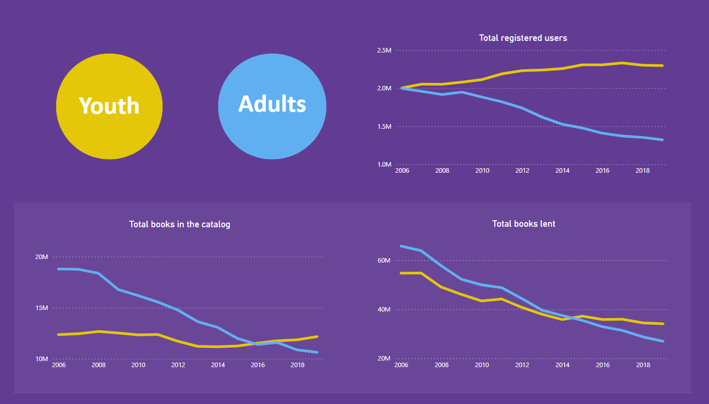

Personal project to gain some practice in Power BI.

Technologie:
- Power BI

When I found out that the government of the Netherlands makes data available on several areas, I was very excited. In the culture section I found data from public libraries, which for me is very interesting as a registered user. So I decided to do some data analysis.

The Power BI dashboards can be seen here: https://app.powerbi.com/groups/me/reports/272bf79d-216c-4696-b029-d6d4b280fc89?ctid=6cea6dc7-0a0b-4328-b449-74cb0c967dae&pbi_source=linkShare&bookmarkGuid=a75803a1-bdb5-419d-b3eb-358fc6c597d3

The complete dataset can be [found here](https://data.overheid.nl/dataset/1217-openbare-bibliotheken#panel-description).

If you're interested in this subject, I found a master's thesis that explains the decline in public library membership.
https://studenttheses.universiteitleiden.nl/access/item%3A2661351/view