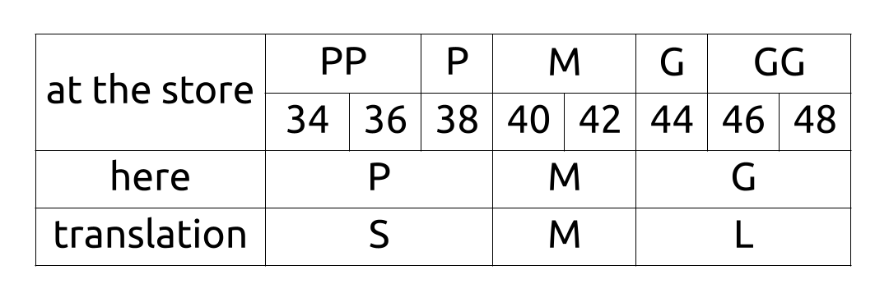
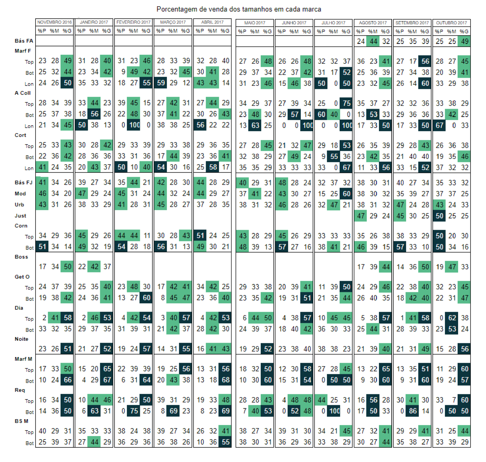
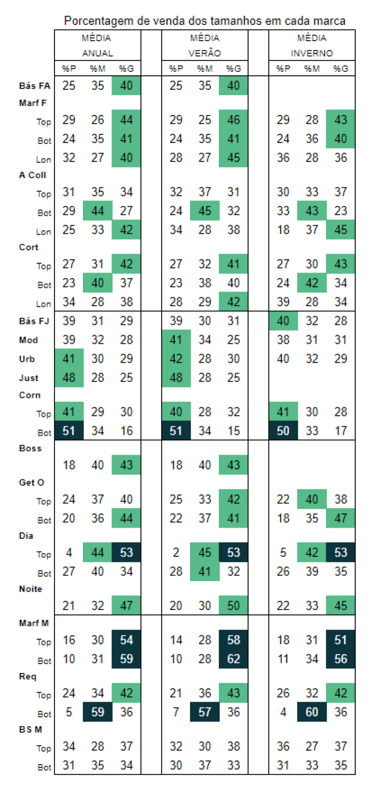

Back in 2016, when I was working at a big retail company in Brazil as sales assistent I did my first data analysis project (even though I didn't know what it was at the time).
___
Study of clothings sizes sold by brand

## Motivation:
 A month after the opening of the store, I noticed that the largests sizes were sold more often in one of the brands for women, which I was responsible for at the time. When I asked my manager if there was a report with the quantity of each size of sold pieces, I was told that the only report with information similar to this was the replenishment report.

I set myself the challenge of manually counting the sold clothing sizes. After a month of analysis, I got the result I imagined and expected: the largests sizes were sold more often.

However, just one month was too short to have a concrete result and so I continued with the analysis in 2017. 

## Methodology:

Every day the replenishment report sheets were printed and I counted the clothing sizes sorting by brand and category (top, bottom and long).

I grouped some sizes as you can see in the table below:

Some important remarks:

Note 1: December 2016 was not analyzed since most of the sales would be to third parties and not to the store's true customers.

Note 2: It's not possible to measure the errors contained in this study, since it was done through a manual count of 29,218 pieces.

Note 3: This study doesn't represents 100% of sales for the period, since not all replenishment report sheets were printed.

## Results:
The following tables show the sales percentages of the sold clothing sizes in each brand.

1. Monthly (Nov/16 - Oct/17)

2. Annual / Summer (Aug-Jan) / Winter (Feb-Jun)  Averages

### **Results by brands**:

Adult Women: Over 40% of the pieces sold in the summer were size G.

Young Women: Over 40% of the pieces sold were size P, and more than 50% of the sold denim bottoms were size P.

Workout and Beachwear: Over 40% of the sold pieces in the summer were size G.

Lingerie: Over 50% of the sold tops were size G.

Pyjama: Over 45% of the sold pieces were size G.

Adult Men Casual: Over 50% of the sold tops and bottoms were size G.

Adult Men Urban: Over 40% of the sold tops were size G and over 57% of the sold bottoms were size M.

Young Men: This was the brand that presented the greatest balance between the amount of sales of each clothing size.

### **Conclusion**:
Among adult brands, the size G was really the most popular. In the young women brand, the most purchased size was P.

Having this information, in the store, the employees can pay more attention to the supply of the most sold sizes. On the Distribution Centers, packs with the proportional amount of this sizes can be sent to the store.

If this information is also true for other stores in this region, the purchasing and styling offices can adjust the product mix, modeling, etc., to better serve the customer's body.
___

In November 2017 I sent a PDF report with this information to my manager and he shared it with the other managers in the region.

My project was very well received by all of them and they were impressed how "a simple store assistant, recently promoted to visual merchandiser" had this perception, interest in looking for more data to validate it and availability to do it outside working hours.

Unfortunately no action was taken from this study.

___

Today, revisiting this project I can't remember why I didn't make graphs to make it easier to visualize the results, since I already had good skills with excel. Anyway, I think this project shows how I'm a data driven person and how I dedicate myself and care about the company I work for.